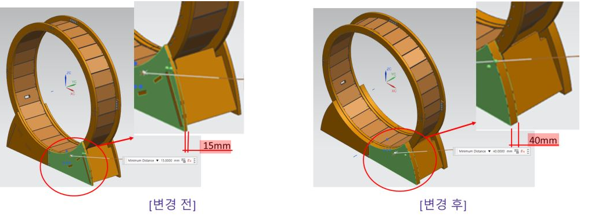
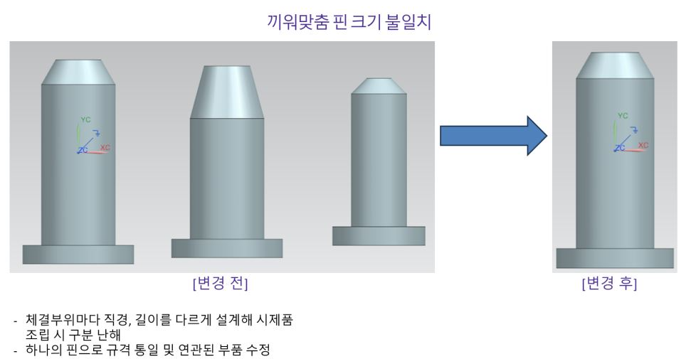
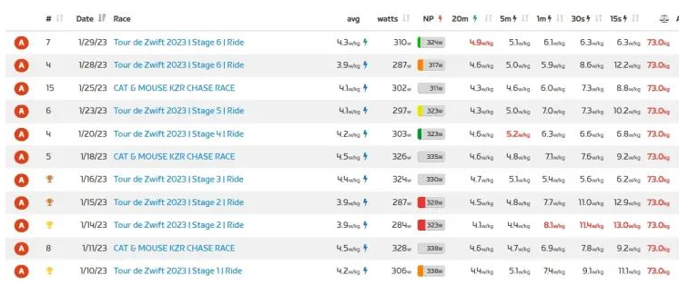

III. 프로젝트 수행 내용 

​    

​    

1. 프로젝트 수행일정 

| **프로젝트 기간** **(ICT****멘토링 사이트 기준****)** | **2023.04.06. ~ 2022.11.30.**   |                   |             |             |             |             |              |              |              |      |      |
| ----------------------------------------------------- | ------------------------------- | ----------------- | ----------- | ----------- | ----------- | ----------- | ------------ | ------------ | ------------ | ---- | ---- |
|                                                       |                                 |                   |             |             |             |             |              |              |              |      |      |
| **구분**                                              | **추진내용**                    | **프로젝트 기간** |             |             |             |             |              |              |              |      |      |
| **3****월**                                           | **4****월**                     | **5****월**       | **6****월** | **7****월** | **8****월** | **9****월** | **10****월** | **11****월** | **12****월** |      |      |
| 계획                                                  | 아이디어 종합 및 주제 선정      |                   | ■           |             |             |             |              |              |              |      |      |
| 분석                                                  | 고양이 특성 및 제품 시장조사    |                   | ■           |             |             |             |              |              |              |      |      |
| 오르가미 분석, 스케치                                 |                                 | ■                 |             |             |             |             |              |              |              |      |      |
| Zwift 분석, 테스트                                    |                                 |                   | ■           |             |             |             |              |              |              |      |      |
| 설계                                                  | 캣휠 기성제품 모델링, 어셈블리  |                   |             | ■           |             |             |              |              |              |      |      |
| 캣휠 시제품 제작                                      |                                 |                   |             | ■           |             |             |              |              |              |      |      |
| 사이클 시제품 제작                                    |                                 |                   |             | ■           |             |             |              |              |              |      |      |
| 개발                                                  | 캣휠 모터 장착, 설계변경        |                   |             |             |             | ■           | ■            |              |              |      |      |
| 사이클 하베스팅 적용                                  |                                 |                   |             |             | ■           | ■           | ■            |              |              |      |      |
| IoT 개발, 블루투스 연동                               |                                 |                   |             |             |             | ■           | ■            |              |              |      |      |
| 제품 제작                                             |                                 |                   |             |             |             |             | ■            |              |              |      |      |
| 테스트                                                | 제품 테스트, 수정               |                   |             |             |             |             |              | ■            | ■            |      |      |
| 종료                                                  | 프로젝트 완료 보고서 준비, 발표 |                   |             |             |             |             |              |              | ■            | ■    |      |

​    

​    

​    

​    

​    

​    

​    

​    

​    

​    

​    

​    

​    

2. 프로젝트 추진 과정에서의 문제점 및 해결방안 

​    

1) 프로젝트 관리 측면 

​      

​    • 수정 전엔 part의 level 개념이 없어 최종 Assy가 무엇인지, 대략적인 부품의 구성은 어떻게 되었는지 확인하기 어려웠다.

​    • part의 이름 앞에 level을 붙여 한 눈에 어떤 구성으로 되어 있는지, 각 하위 Assy는 어떤 품목으로 구성되는지 알기 쉽게 수정했다.

​    

​    

​    

​    

2) 프로젝트 개발 측면 

​       

   (1) Scale 0.3 적용으로 인한 끼워맞춤 깊이 부족

​    • 3D 프린터의 출력 최대 크기: 200x200x200

​    • 시제품 제작 시 최장 길이 535mm로 Scale 0.3 적용

​    • Scale 적용 시, 끼워맞춤 깊이가 부족하여 제품의 두께를 증가시킴

​    

​    

    

   (2) 끼워맞춤 핀 크기 불일치

​    • 체결 부위마다 직경, 길이를 다르게 설계해 시제품 조립 시 구분 난해

​    • 하나의 핀으로 규격 통일, 연관된 부품 수정

​    

​    

​    

3. 프로젝트를 통해 배우거나 느낀 점 
4. ICT프로젝트를 통해 제품이 만들어지는 과정을 자세히 알게 되었고 제품을 구동시키는 과정이 어려웠다.

​    

2) 프로젝트를 통해 새로운 기술을 배우고 기존 지식을 실전에 적용해볼 수 있었습니다. 이를 통해 전문성을 향상시키고 자기 계발에 도움이 되었습니다.

​    

3) 학습한 이론을 실전에 적용해보고, 실제 상황에서의 동작과 결과를 경험할 수 있어 성취감을 느꼈습니다.

​    

4) 프로젝트를 통해 얻은 경험과 결과를 분석하고 피드백을 받아 개선해 나가는 과정을 통해 지속적인 학습의 기회를 얻게 되어 배운게 많았습니다.

​    

​    

**Ⅳ**. 기대효과 및 활용분야 

​    

​    

1. 프로젝트의 기대효과 

     

• 반려동물과 함께 운동함으로써 만족도 높아진다.

     